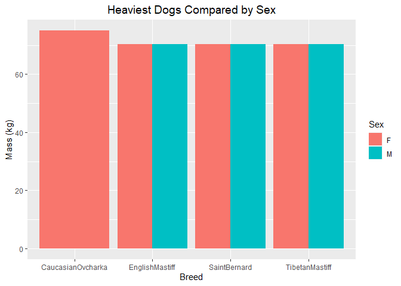
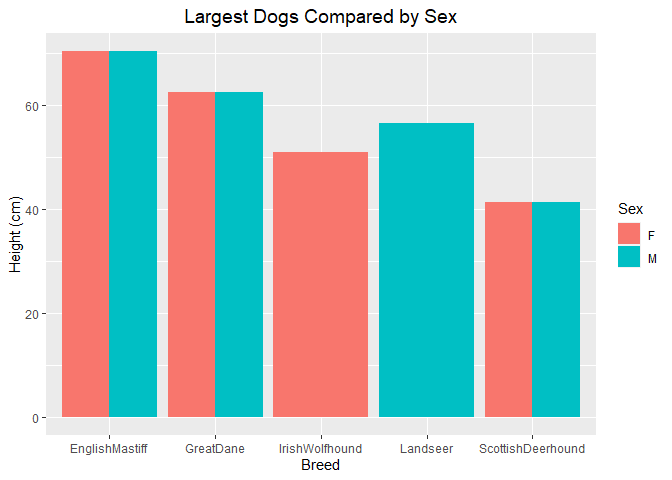
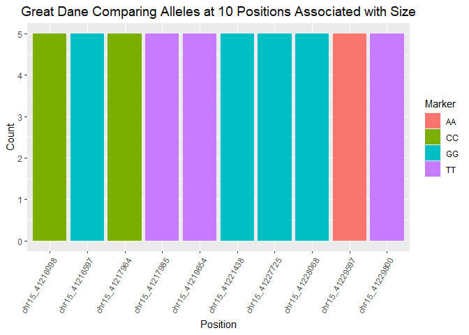
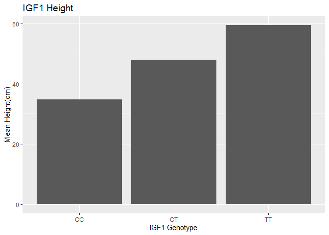
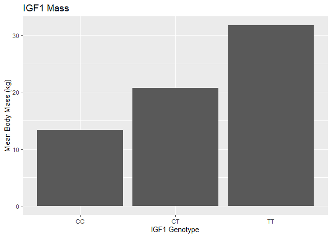
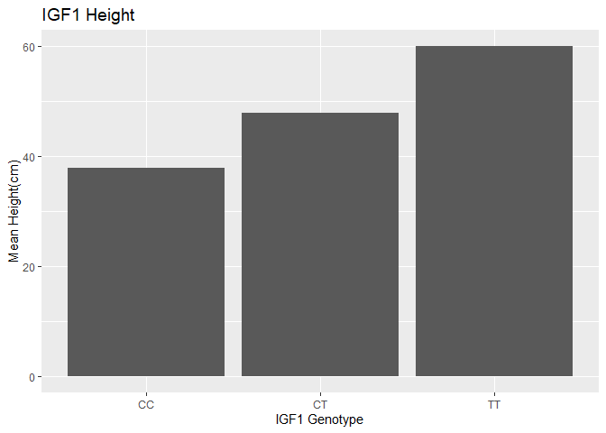
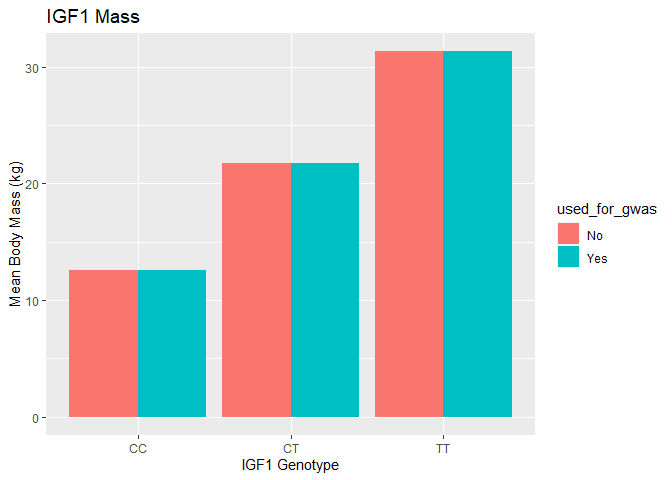
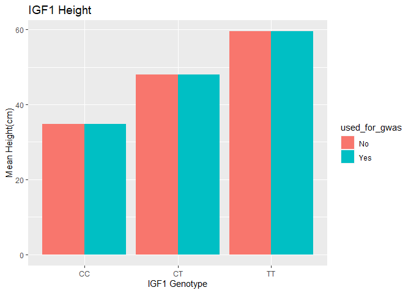

## Loading the Libraries


```r
library(tidyverse)
```

```
## ── Attaching core tidyverse packages ──────────────────────── tidyverse 2.0.0 ──
## ✔ dplyr     1.1.4     ✔ readr     2.1.5
## ✔ forcats   1.0.0     ✔ stringr   1.5.1
## ✔ ggplot2   3.4.4     ✔ tibble    3.2.1
## ✔ lubridate 1.9.3     ✔ tidyr     1.3.0
## ✔ purrr     1.0.2     
## ── Conflicts ────────────────────────────────────────── tidyverse_conflicts() ──
## ✖ dplyr::filter() masks stats::filter()
## ✖ dplyr::lag()    masks stats::lag()
## ℹ Use the conflicted package (<http://conflicted.r-lib.org/>) to force all conflicts to become errors
```

```r
library(janitor)
```

```
## 
## Attaching package: 'janitor'
## 
## The following objects are masked from 'package:stats':
## 
##     chisq.test, fisher.test
```

```r
library(naniar)
library(ggmap)
```

```
## Warning: package 'ggmap' was built under R version 4.3.3
```

```
## ℹ Google's Terms of Service: <https://mapsplatform.google.com>
##   Stadia Maps' Terms of Service: <https://stadiamaps.com/terms-of-service/>
##   OpenStreetMap's Tile Usage Policy: <https://operations.osmfoundation.org/policies/tiles/>
## ℹ Please cite ggmap if you use it! Use `citation("ggmap")` for details.
```

```r
library(shiny)
```

```
## Warning: package 'shiny' was built under R version 4.3.3
```

```r
library(shinydashboard)
```

```
## Warning: package 'shinydashboard' was built under R version 4.3.3
```

```
## 
## Attaching package: 'shinydashboard'
## 
## The following object is masked from 'package:graphics':
## 
##     box
```

## Loading the Data Set   


```r
dog <- read_csv(file = "/Users/boy/Desktop/BIS15W2024_rchu/BIS15W2024_group15-main/BIS15W2024_group15-main/dog_breeds_data/dogbreeddataset.xlsx - A.csv")
```

```
## New names:
## Rows: 1299 Columns: 25
## ── Column specification
## ──────────────────────────────────────────────────────── Delimiter: "," chr
## (25): Data S1. Modern dog breeds dataset. Related to Figures 1 and S4, ....
## ℹ Use `spec()` to retrieve the full column specification for this data. ℹ
## Specify the column types or set `show_col_types = FALSE` to quiet this message.
## • `` -> `...2`
## • `` -> `...3`
## • `` -> `...4`
## • `` -> `...5`
## • `` -> `...6`
## • `` -> `...7`
## • `` -> `...8`
## • `` -> `...9`
## • `` -> `...10`
## • `` -> `...11`
## • `` -> `...12`
## • `` -> `...13`
## • `` -> `...14`
## • `` -> `...15`
## • `` -> `...17`
## • `` -> `...18`
## • `` -> `...19`
## • `` -> `...20`
## • `` -> `...21`
## • `` -> `...22`
## • `` -> `...23`
## • `` -> `...24`
## • `` -> `...25`
```

## Fixing the Headers

### Renaming the headers as the values from the first row  


```r
names(dog) <- dog[1,]
```

```
## Warning: The `value` argument of `names<-()` must be a character vector as of tibble
## 3.0.0.
## This warning is displayed once every 8 hours.
## Call `lifecycle::last_lifecycle_warnings()` to see where this warning was
## generated.
```

### Removing the first row in the data set  


```r
dog <- dog %>% 
        filter(!row_number() %in% 1) 
```

## Cleaning up the Variable Names.   


```r
dog <- clean_names(dog)
```

## Determining if the data is Tidy; Cleaning up the Data  


```r
summary(dog)
```

```
##   sample_id            breed               type           body_mass_kg      
##  Length:1298        Length:1298        Length:1298        Length:1298       
##  Class :character   Class :character   Class :character   Class :character  
##  Mode  :character   Mode  :character   Mode  :character   Mode  :character  
##   height_cm             sex            coverage_all        coverage_x       
##  Length:1298        Length:1298        Length:1298        Length:1298       
##  Class :character   Class :character   Class :character   Class :character  
##  Mode  :character   Mode  :character   Mode  :character   Mode  :character  
##  bio_project         bio_sample         longitude           latitude        
##  Length:1298        Length:1298        Length:1298        Length:1298       
##  Class :character   Class :character   Class :character   Class :character  
##  Mode  :character   Mode  :character   Mode  :character   Mode  :character  
##  igf1_as_genotype   used_for_gwas     
##  Length:1298        Length:1298       
##  Class :character   Class :character  
##  Mode  :character   Mode  :character  
##  group_in_phylogenetic_analyses_d_statistics chr15_41216098    
##  Length:1298                                 Length:1298       
##  Class :character                            Class :character  
##  Mode  :character                            Mode  :character  
##  chr15_41216597     chr15_41217964     chr15_41217985     chr15_41219654    
##  Length:1298        Length:1298        Length:1298        Length:1298       
##  Class :character   Class :character   Class :character   Class :character  
##  Mode  :character   Mode  :character   Mode  :character   Mode  :character  
##  chr15_41221438     chr15_41227725     chr15_41228068     chr15_41229597    
##  Length:1298        Length:1298        Length:1298        Length:1298       
##  Class :character   Class :character   Class :character   Class :character  
##  Mode  :character   Mode  :character   Mode  :character   Mode  :character  
##  chr15_41229800    
##  Length:1298       
##  Class :character  
##  Mode  :character
```

#### We notice that all the variables are of data class character, which is not desired for the variables `body_mass_kg`, `heigh_cm`.   

### Where are the NA's?   


```r
miss_var_summary(dog)
```

```
## # A tibble: 25 × 3
##    variable       n_miss pct_miss
##    <chr>           <int>    <dbl>
##  1 bio_sample        486    37.4 
##  2 height_cm         277    21.3 
##  3 sex               270    20.8 
##  4 body_mass_kg      243    18.7 
##  5 longitude         163    12.6 
##  6 latitude          163    12.6 
##  7 chr15_41217964    158    12.2 
##  8 chr15_41217985    146    11.2 
##  9 chr15_41221438    120     9.24
## 10 chr15_41228068    120     9.24
## # ℹ 15 more rows
```

### Changing the Data Class of Certain Variables.   


```r
dog <- dog %>% 
        mutate(body_mass_kg = as.numeric(body_mass_kg)) %>% 
        mutate(height_cm = as.numeric(height_cm)) %>% 
        mutate(latitude = as.numeric(latitude)) %>% 
        mutate(longitude = as.numeric(longitude))
```

```
## Warning: There was 1 warning in `mutate()`.
## ℹ In argument: `latitude = as.numeric(latitude)`.
## Caused by warning:
## ! NAs introduced by coercion
```

```
## Warning: There was 1 warning in `mutate()`.
## ℹ In argument: `longitude = as.numeric(longitude)`.
## Caused by warning:
## ! NAs introduced by coercion
```

# Data Exploration   

## How many distinct breeds of dog are included within this data set?   


```r
n_distinct(dog$breed)
```

```
## [1] 269
```

## How many distinct data points are included (in terms of body weight and height) within this data set?   


```r
n_distinct(dog$body_mass_kg)
```

```
## [1] 142
```


```r
n_distinct(dog$height_cm)
```

```
## [1] 104
```

## Which breed of dog has the largest body mass?    


```r
dog %>% 
       group_by(breed) %>% 
        summarize(mean_body_weight = mean(body_mass_kg, na.rm = T)) %>% 
        filter(mean_body_weight != "NaN") %>% 
        arrange(desc(mean_body_weight))
```

```
## # A tibble: 207 × 2
##    breed                   mean_body_weight
##    <chr>                              <dbl>
##  1 CaucasianOvcharka                   75  
##  2 Boerboel                            73  
##  3 EnglishMastiff                      70.3
##  4 SaintBernard                        70.3
##  5 TibetanMastiff                      70.3
##  6 TosaInu                             68  
##  7 GreatDane                           62.4
##  8 GreaterSwissMountainDog             60  
##  9 NeapolitanMastiff                   60  
## 10 DogueDeBordeaux                     59.5
## # ℹ 197 more rows
```

## Which breed of dog has the largest height?    


```r
dog %>% 
       group_by(breed) %>% 
        summarize(mean_height = mean(height_cm, na.rm = T)) %>% 
        filter(mean_height != "NaN") %>% 
        arrange(desc(mean_height))
```

```
## # A tibble: 201 × 2
##    breed                mean_height
##    <chr>                      <dbl>
##  1 GreatDane                   78.7
##  2 IrishWolfhound              78.7
##  3 Akbash                      77.5
##  4 AnatolianShepherdDog        76  
##  5 ScottishDeerhound           74.9
##  6 Landseer                    73.5
##  7 EnglishMastiff              73  
##  8 Leonberger                  72.5
##  9 GreatPyrenees               71.8
## 10 Greyhound                   71.8
## # ℹ 191 more rows
```

## Which breed of dog has the smallest height?    


```r
dog %>% 
       group_by(breed) %>% 
        summarize(mean_height = mean(height_cm, na.rm = T)) %>% 
        filter(mean_height != "NaN") %>% 
        arrange(mean_height)
```

```
## # A tibble: 201 × 2
##    breed            mean_height
##    <chr>                  <dbl>
##  1 YorkshireTerrier        16.5
##  2 BrusselsGriffon         17.8
##  3 Chihuahua               19  
##  4 Pekingese               19  
##  5 Pomeranian              20  
##  6 Maltese                 22.5
##  7 BiewerTerrier           22.9
##  8 JapaneseChin            23.5
##  9 NorfolkTerrier          24  
## 10 Papillon                24  
## # ℹ 191 more rows
```

## How do the top 5 heaviest dogs compare by sex?       


```r
dog %>% 
        filter(sex != "NA") %>% 
        unite(breed_sex, "breed", "sex", sep = " ") %>% 
        filter(str_detect(.$breed_sex, "CaucasianOvcharka") | str_detect(.$breed_sex, "Boerboel") | str_detect(.$breed_sex, "EnglishMastiff") | str_detect(.$breed_sex, "SaintBernard") | str_detect(.$breed_sex, "TibetanMastiff")) %>% 
        group_by(breed_sex) %>% 
        summarize(mean_body_mass = mean(body_mass_kg, na.rm = T)) %>% 
        separate(breed_sex, into = c("breed", "sex"), sep = " ") %>% 
        ggplot(aes(x = breed, y = mean_body_mass, fill = sex)) +
        geom_col(position = "dodge") +
        labs(title = "Heaviest Dogs Compared by Sex",
             x = "Breed",
             y = "Mass (kg)",
             fill = "Sex") +
        theme(plot.title = element_text(size = rel(1.3), hjust = 0.5))
```

<!-- -->

It seems that this dataset has strange or incomplete measurements for mass, so it may be more worthwhile to focus on height!   

## How do the top 5 largest dogs compare by sex?       


```r
dog %>% 
        filter(sex != "NA") %>% 
        unite(breed_sex, "breed", "sex", sep = " ") %>% 
        filter(str_detect(.$breed_sex, "GreatDane") | str_detect(.$breed_sex, "IrishWolfhound") | str_detect(.$breed_sex, "Landseer") | str_detect(.$breed_sex, "EnglishMastiff") | str_detect(.$breed_sex, "ScottishDeerhound")) %>% 
        group_by(breed_sex) %>% 
        summarize(mean_body_mass = mean(body_mass_kg, na.rm = T)) %>% 
        separate(breed_sex, into = c("breed", "sex"), sep = " ") %>% 
        ggplot(aes(x = breed, y = mean_body_mass, fill = sex)) +
        geom_col(position = "dodge") +
        labs(title = "Largest Dogs Compared by Sex",
             x = "Breed",
             y = "Height (cm)",
             fill = "Sex") +
        theme(plot.title = element_text(size = rel(1.3), hjust = 0.5))
```

<!-- -->

This appears to show that there are also shows that there a lot of missing values in this dataset!   

## Removing NA's from Sex Variable for Future Analyses   


```r
dog <- dog %>% 
        filter(sex != "NA")
```

## Comparing Top Tallest Dogs versus Top Smallest Dogs by Alleles in Locations that are Important in Determining Dog Body Size    

Test Visual:   


```r
dog %>%
        filter(breed == "GreatDane") %>% 
        pivot_longer(cols = starts_with("chr15"),
                     names_to = "chr_location",
                     values_to = "marker_alleles_data") %>% 
        ggplot(aes(x = chr_location, fill = marker_alleles_data)) +
        geom_bar() +
        labs(title = "Great Dane Comparing Alleles at 10 Positions Associated with Size",
             x = "Position",
             y = "Count",
             fill = "Marker") +
        theme(plot.title = element_text(size = rel(1.3), hjust = 0.5), axis.text.x = element_text(angle = 60, hjust = 1)) 
```

<!-- -->


```r
ui <- dashboardPage(
  dashboardHeader(title = "Dogs and Markers"),
  dashboardSidebar(disable=T),
  dashboardBody(
          
          fluidRow(
  box(title = "Plot Options", width = 3,
  radioButtons("x", "Select Height Category", choices = c("small", "large"), selected = "large"),
  ), #closes the first box
  box(title = "Dog Size and Markers", width = 8,
  plotOutput("plot", width = "500px", height = "400px")
  
  ) #closes the second box
  ) #closes the row
  ) #closes the dashboard body
) #closes the ui 

server <- function(input, output, session) {
        
        session$onSessionEnded(stopApp)
        
        output$plot <- renderPlot ({
          
        dog %>%
        mutate(height_category = case_when(height_cm <= 20.0 ~ "small",
                                           height_cm > 20.0 & height_cm < 73.0 ~ "medium",
                                           height_cm >= 73.0 ~ "large")) %>% 
        filter(height_category == "small" | height_category == "large") %>% 
        pivot_longer(cols = starts_with("chr15"),
                     names_to = "chr_location",
                     values_to = "marker_alleles_data") %>% 
        filter(height_category == input$x) %>% 
        ggplot(aes(x = chr_location, fill = marker_alleles_data)) +
        geom_bar() +
        facet_wrap(breed~.) +
        labs(title = "Largest Dogs Compared by Sex",
             x = "Position",
             y = "Count",
             fill = "Marker") +
        theme(plot.title = element_text(size = rel(1.3), hjust = 0.5), axis.text.x = element_text(angle = 90, hjust = 1))
        
})
        
}

shinyApp(ui, server)
```

```{=html}
<div style="width: 100% ; height: 400px ; text-align: center; box-sizing: border-box; -moz-box-sizing: border-box; -webkit-box-sizing: border-box;" class="muted well">Shiny applications not supported in static R Markdown documents</div>
```

## A New Long Format Object, and Comparing Alleles in Small vs Large Dogs   


```r
dog_long <- dog %>%
        mutate(height_category = case_when(height_cm <= 20.0 ~ "small",
                                           height_cm > 20.0 & height_cm < 73.0 ~ "medium",
                                           height_cm >= 73.0 ~ "large")) %>% 
        filter(height_category == "small" | height_category == "large") %>% 
        pivot_longer(cols = starts_with("chr15"),
                     names_to = "chr_location",
                     values_to = "marker_alleles_data")
```


```r
ui <- dashboardPage(
  dashboardHeader(title = "Dogs and Markers"),
  dashboardSidebar(disable=T),
  dashboardBody(
          
          fluidRow(
  box(title = "Plot Options", width = 3,
  radioButtons("x", "Select Chromosome Position", choices = unique(dog_long$chr_location), hr()),
  ), #closes the first box
  box(title = "Dog Size and Markers", width = 8,
  plotOutput("plot", width = "500px", height = "400px")
  
  ) #closes the second box
  ) #closes the row
  ) #closes the dashboard body
) #closes the ui 

server <- function(input, output, session) {
        
        session$onSessionEnded(stopApp)
        
        output$plot <- renderPlot ({
          
        dog_long %>%
        filter(chr_location == input$x) %>% 
        ggplot(aes(x = height_category, fill = marker_alleles_data)) +
        geom_bar() +
        labs(title = "Largest vs Smallest Dogs",
             x = "Height Category",
             y = "Count",
             fill = "Marker") +
        theme(plot.title = element_text(size = rel(1.3), hjust = 0.5), axis.text.x = element_text(angle = 90, hjust = 1))
        
})
        
}

shinyApp(ui, server)
```

```{=html}
<div style="width: 100% ; height: 400px ; text-align: center; box-sizing: border-box; -moz-box-sizing: border-box; -webkit-box-sizing: border-box;" class="muted well">Shiny applications not supported in static R Markdown documents</div>
```

## Examining Geographic Distribution and Creating a Map  


```r
dog %>% 
  select(latitude, longitude) %>% 
  summary()
```

```
##     latitude          longitude     
##  Min.   :-154.548   Min.   :-38.04  
##  1st Qu.:  -2.899   1st Qu.: 44.42  
##  Median :  -0.119   Median : 51.17  
##  Mean   :  11.785   Mean   : 45.73  
##  3rd Qu.:  13.573   3rd Qu.: 52.51  
##  Max.   : 151.969   Max.   : 68.12  
##  NA's   :153        NA's   :153
```


## IGF1 Genotype 


```r
dog %>%
  group_by(igf1_as_genotype)%>%
  summarise(meanbodymass=mean(body_mass_kg, na.rm=T), meanheight=mean(height_cm, na.rm=T))
```

```
## # A tibble: 3 × 3
##   igf1_as_genotype meanbodymass meanheight
##   <chr>                   <dbl>      <dbl>
## 1 CC                       12.6       34.8
## 2 CT                       21.7       48.0
## 3 TT                       31.3       59.5
```


```r
dog %>%
  group_by(igf1_as_genotype) %>%
  summarise(meanbodymass=mean(body_mass_kg, na.rm=T)) %>%
  ggplot(aes(x=igf1_as_genotype, y=meanbodymass))+
  geom_col()+
  labs(title = "IGF1 Mass", x = "IGF1 Genotype", y= "Mean Body Mass (kg)")+
  theme(plot.title = element_text(size = rel(1.3)))
```

<!-- -->


```r
dog %>%
  group_by(igf1_as_genotype) %>%
  summarise(meanheight=mean(height_cm, na.rm=T)) %>%
  ggplot(aes(x=igf1_as_genotype, y=meanheight))+
  geom_col()+
  labs(title = "IGF1 Height", x = "IGF1 Genotype", y= "Mean Height(cm)")+
  theme(plot.title = element_text(size = rel(1.3)))
```

<!-- -->

## IGF1 GWAS


```r
dog_gwas <- filter(dog, used_for_gwas == "Yes")
```


```r
dog_gwas %>%
  group_by(igf1_as_genotype)%>%
  summarise(meanbodymass=mean(body_mass_kg, na.rm=T), meanheight=mean(height_cm, na.rm=T))
```

```
## # A tibble: 3 × 3
##   igf1_as_genotype meanbodymass meanheight
##   <chr>                   <dbl>      <dbl>
## 1 CC                       13.4       37.8
## 2 CT                       20.8       47.8
## 3 TT                       31.7       59.9
```


```r
dog_gwas %>%
  group_by(igf1_as_genotype) %>%
  summarise(meanbodymass=mean(body_mass_kg, na.rm=T)) %>%
  ggplot(aes(x=igf1_as_genotype, y=meanbodymass))+
  geom_col()+
  labs(title = "IGF1 Mass", x = "IGF1 Genotype", y= "Mean Body Mass (kg)")+
  theme(plot.title = element_text(size = rel(1.3)))
```

<!-- -->


```r
dog_gwas %>%
  group_by(igf1_as_genotype) %>%
  summarise(meanheight=mean(height_cm, na.rm=T)) %>%
  ggplot(aes(x=igf1_as_genotype, y=meanheight))+
  geom_col()+
  labs(title = "IGF1 Height", x = "IGF1 Genotype", y= "Mean Height(cm)")+
  theme(plot.title = element_text(size = rel(1.3)))
```

<!-- -->

## side by side


```r
dog %>%
  group_by(igf1_as_genotype) %>%
  summarise(used_for_gwas, meanbodymass=mean(body_mass_kg, na.rm=T)) %>%
  ggplot(aes(x=igf1_as_genotype, y=meanbodymass, fill = used_for_gwas))+
  geom_col(position = "dodge")+
  labs(title = "IGF1 Mass", x = "IGF1 Genotype", y= "Mean Body Mass (kg)")+
  theme(plot.title = element_text(size = rel(1.3)))
```

```
## Warning: Returning more (or less) than 1 row per `summarise()` group was deprecated in
## dplyr 1.1.0.
## ℹ Please use `reframe()` instead.
## ℹ When switching from `summarise()` to `reframe()`, remember that `reframe()`
##   always returns an ungrouped data frame and adjust accordingly.
## Call `lifecycle::last_lifecycle_warnings()` to see where this warning was
## generated.
```

```
## `summarise()` has grouped output by 'igf1_as_genotype'. You can override using
## the `.groups` argument.
```

<!-- -->


```r
dog %>%
  group_by(igf1_as_genotype) %>%
  summarise(used_for_gwas, meanheight=mean(height_cm, na.rm=T)) %>%
  ggplot(aes(x=igf1_as_genotype, y=meanheight, fill = used_for_gwas))+
  geom_col(position = "dodge")+
  labs(title = "IGF1 Height", x = "IGF1 Genotype", y= "Mean Height(cm)")+
  theme(plot.title = element_text(size = rel(1.3)))
```

```
## Warning: Returning more (or less) than 1 row per `summarise()` group was deprecated in
## dplyr 1.1.0.
## ℹ Please use `reframe()` instead.
## ℹ When switching from `summarise()` to `reframe()`, remember that `reframe()`
##   always returns an ungrouped data frame and adjust accordingly.
## Call `lifecycle::last_lifecycle_warnings()` to see where this warning was
## generated.
```

```
## `summarise()` has grouped output by 'igf1_as_genotype'. You can override using
## the `.groups` argument.
```

<!-- -->
## IGF1 of largest dogs


```r
dog %>%
  group_by(breed) %>%
  summarize(mean_body_weight = mean(body_mass_kg, na.rm = T), igf1_as_genotype) %>% 
  filter(mean_body_weight != "NaN") %>% 
  arrange(desc(mean_body_weight))
```

```
## Warning: Returning more (or less) than 1 row per `summarise()` group was deprecated in
## dplyr 1.1.0.
## ℹ Please use `reframe()` instead.
## ℹ When switching from `summarise()` to `reframe()`, remember that `reframe()`
##   always returns an ungrouped data frame and adjust accordingly.
## Call `lifecycle::last_lifecycle_warnings()` to see where this warning was
## generated.
```

```
## `summarise()` has grouped output by 'breed'. You can override using the
## `.groups` argument.
```

```
## # A tibble: 838 × 3
## # Groups:   breed [184]
##    breed             mean_body_weight igf1_as_genotype
##    <chr>                        <dbl> <chr>           
##  1 CaucasianOvcharka             75   TT              
##  2 EnglishMastiff                70.3 TT              
##  3 EnglishMastiff                70.3 TT              
##  4 EnglishMastiff                70.3 TT              
##  5 SaintBernard                  70.3 TT              
##  6 SaintBernard                  70.3 TT              
##  7 TibetanMastiff                70.3 CC              
##  8 TibetanMastiff                70.3 TT              
##  9 TibetanMastiff                70.3 CT              
## 10 TibetanMastiff                70.3 CT              
## # ℹ 828 more rows
```


