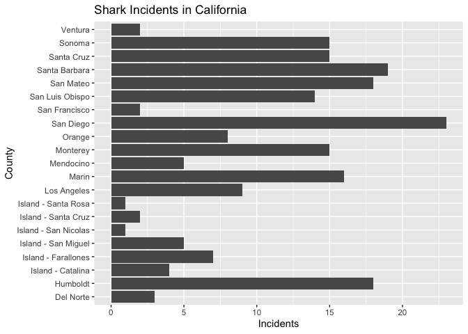
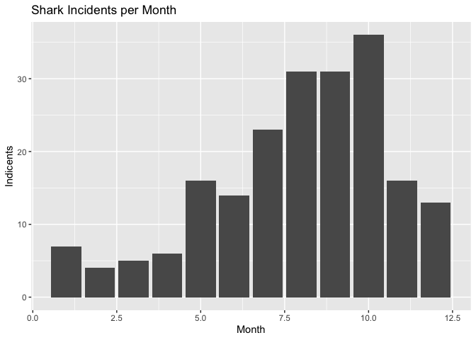
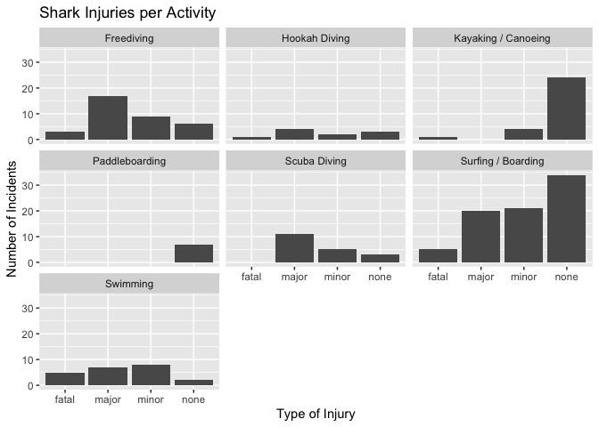
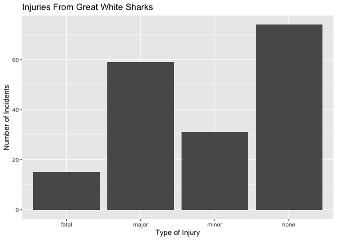
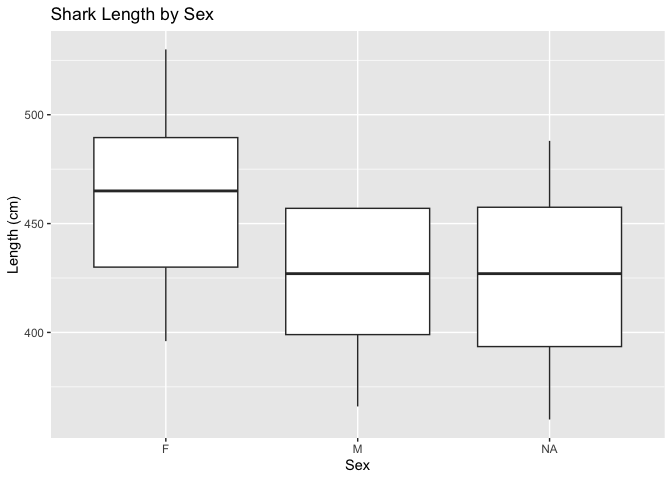
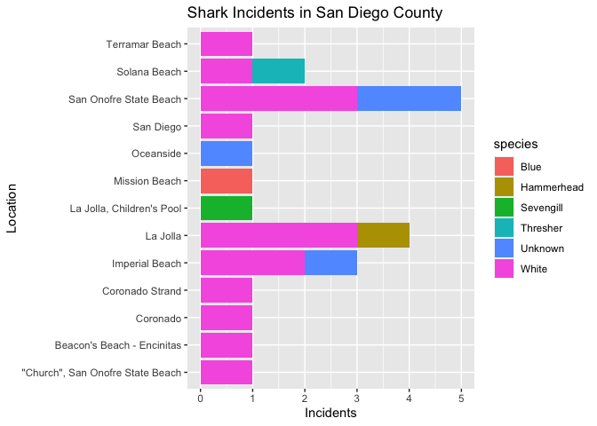

## Instructions
Answer the following questions and complete the exercises in RMarkdown. Please embed all of your code and push your final work to your repository. Your code must be organized, clean, and run free from errors. Remember, you must remove the `#` for any included code chunks to run. Be sure to add your name to the author header above. 

Your code must knit in order to be considered. If you are stuck and cannot answer a question, then comment out your code and knit the document. You may use your notes, labs, and homework to help you complete this exam. Do not use any other resources- including AI assistance.  

Don't forget to answer any questions that are asked in the prompt. Some questions will require a plot, but others do not- make sure to read each question carefully.  

For the questions that require a plot, make sure to have clearly labeled axes and a title. Keep your plots clean and professional-looking, but you are free to add color and other aesthetics.  

Be sure to follow the directions and upload your exam on Gradescope.    

## Background
In the `data` folder, you will find data about shark incidents in California between 1950-2022. The [data](https://catalog.data.gov/dataset/shark-incident-database-california-56167) are from: State of California- Shark Incident Database.   

## Load the libraries

```r
library("tidyverse")
library("janitor")
library("naniar")
```

## Load the data
Run the following code chunk to import the data.

```r
sharks <- read_csv("data/SharkIncidents_1950_2022_220302.csv") %>% clean_names()
```

## Questions
1. (1 point) Start by doing some data exploration using your preferred function(s). What is the structure of the data? Where are the missing values and how are they represented?  


```r
str(sharks)
```

```
## spc_tbl_ [211 × 16] (S3: spec_tbl_df/tbl_df/tbl/data.frame)
##  $ incident_num    : chr [1:211] "1" "2" "3" "4" ...
##  $ month           : num [1:211] 10 5 12 2 8 4 10 5 6 7 ...
##  $ day             : num [1:211] 8 27 7 6 14 28 12 7 14 28 ...
##  $ year            : num [1:211] 1950 1952 1952 1955 1956 ...
##  $ time            : chr [1:211] "12:00" "14:00" "14:00" "12:00" ...
##  $ county          : chr [1:211] "San Diego" "San Diego" "Monterey" "Monterey" ...
##  $ location        : chr [1:211] "Imperial Beach" "Imperial Beach" "Lovers Point" "Pacific Grove" ...
##  $ mode            : chr [1:211] "Swimming" "Swimming" "Swimming" "Freediving" ...
##  $ injury          : chr [1:211] "major" "minor" "fatal" "minor" ...
##  $ depth           : chr [1:211] "surface" "surface" "surface" "surface" ...
##  $ species         : chr [1:211] "White" "White" "White" "White" ...
##  $ comment         : chr [1:211] "Body Surfing, bit multiple times on leg, thigh and body" "Foot & swim fin bitten" "Attacked from below then second time from front, fatal" "Attacked from behind, lost swim fin" ...
##  $ longitude       : chr [1:211] "-117.1466667" "-117.2466667" "-122.05" "-122.15" ...
##  $ latitude        : num [1:211] 32.6 32.6 36.6 36.6 35.1 ...
##  $ confirmed_source: chr [1:211] "Miller/Collier, Coronado Paper, Oceanside Paper" "GSAF - with photos" "Miller/Collier, Coronado Paper" "Miller/Collier, Santa Cruz Sentinel" ...
##  $ wfl_case_number : chr [1:211] NA NA NA NA ...
##  - attr(*, "spec")=
##   .. cols(
##   ..   IncidentNum = col_character(),
##   ..   Month = col_double(),
##   ..   Day = col_double(),
##   ..   Year = col_double(),
##   ..   Time = col_character(),
##   ..   County = col_character(),
##   ..   Location = col_character(),
##   ..   Mode = col_character(),
##   ..   Injury = col_character(),
##   ..   Depth = col_character(),
##   ..   Species = col_character(),
##   ..   Comment = col_character(),
##   ..   Longitude = col_character(),
##   ..   Latitude = col_double(),
##   ..   `Confirmed Source` = col_character(),
##   ..   `WFL Case #` = col_character()
##   .. )
##  - attr(*, "problems")=<externalptr>
```


```r
sharks %>%
  naniar::miss_var_summary()
```

```
## # A tibble: 16 × 3
##    variable         n_miss pct_miss
##    <chr>             <int>    <dbl>
##  1 wfl_case_number     202   95.7  
##  2 time                  7    3.32 
##  3 latitude              6    2.84 
##  4 longitude             5    2.37 
##  5 confirmed_source      1    0.474
##  6 incident_num          0    0    
##  7 month                 0    0    
##  8 day                   0    0    
##  9 year                  0    0    
## 10 county                0    0    
## 11 location              0    0    
## 12 mode                  0    0    
## 13 injury                0    0    
## 14 depth                 0    0    
## 15 species               0    0    
## 16 comment               0    0
```

2. (1 point) Notice that there are some incidents identified as "NOT COUNTED". These should be removed from the data because they were either not sharks, unverified, or were provoked. It's OK to replace the `sharks` object.


```r
sharks_counted <- filter(sharks, incident_num != "NOT COUNTED")
sharks_counted
```

```
## # A tibble: 202 × 16
##    incident_num month   day  year time    county     location mode  injury depth
##    <chr>        <dbl> <dbl> <dbl> <chr>   <chr>      <chr>    <chr> <chr>  <chr>
##  1 1               10     8  1950 12:00   San Diego  Imperia… Swim… major  surf…
##  2 2                5    27  1952 14:00   San Diego  Imperia… Swim… minor  surf…
##  3 3               12     7  1952 14:00   Monterey   Lovers … Swim… fatal  surf…
##  4 4                2     6  1955 12:00   Monterey   Pacific… Free… minor  surf…
##  5 5                8    14  1956 16:30   San Luis … Pismo B… Swim… major  surf…
##  6 6                4    28  1957 13:30   San Luis … Morro B… Swim… fatal  surf…
##  7 7               10    12  1958 Unknown San Diego  Coronad… Swim… major  surf…
##  8 8                5     7  1959 17:30   San Franc… Baker B… Swim… fatal  surf…
##  9 9                6    14  1959 17:00   San Diego  La Jolla Free… fatal  surf…
## 10 10               7    28  1959 19:30   San Diego  La Jolla Free… minor  surf…
## # ℹ 192 more rows
## # ℹ 6 more variables: species <chr>, comment <chr>, longitude <chr>,
## #   latitude <dbl>, confirmed_source <chr>, wfl_case_number <chr>
```

3. (3 points) Are there any "hotspots" for shark incidents in California? Make a plot that shows the total number of incidents per county. Which county has the highest number of incidents?

San Diego has the highest number of shark incidents. 


```r
sharks_counted %>%
  ggplot(aes(x=county))+
  geom_bar()+
  coord_flip()+
  labs(title = "Shark Incidents in California", x = "County", y = "Incidents")
```

<!-- -->

4. (3 points) Are there months of the year when incidents are more likely to occur? Make a plot that shows the total number of incidents by month. Which month has the highest number of incidents?  

Month 10 (October) has the highest number of shark incidents. 


```r
sharks_counted %>%
  ggplot(aes(x=month))+
  geom_bar()+
  labs(title = "Shark Incidents per Month", x = "Month", y = "Indicents")
```

<!-- -->

5. (3 points) How do the number and types of injuries compare by county? Make a table (not a plot) that shows the number of injury types by county. Which county has the highest number of fatalities?  

San Luis Obispo has the highest number of fatal shark injuries. 


```r
sharks_counted %>%
  group_by(county) %>%
  count(injury)%>%
  pivot_wider(names_from = "injury", values_from = "n")%>%
  arrange(desc(fatal))
```

```
## # A tibble: 21 × 5
## # Groups:   county [21]
##    county              minor  none major fatal
##    <chr>               <int> <int> <int> <int>
##  1 San Luis Obispo         1     7     3     3
##  2 Monterey                2     3     8     2
##  3 San Diego               8     9     4     2
##  4 Santa Barbara           6     9     2     2
##  5 Island - San Miguel     2    NA     2     1
##  6 Los Angeles             6     2    NA     1
##  7 Mendocino               1    NA     3     1
##  8 San Francisco          NA     1    NA     1
##  9 San Mateo               4    12     1     1
## 10 Santa Cruz              3     8     3     1
## # ℹ 11 more rows
```

6. (2 points) In the data, `mode` refers to a type of activity. Which activity is associated with the highest number of incidents?

Surfing/Boarding has the highest number of shark incidents. 


```r
sharks_counted %>%
  group_by(mode)%>%
  summarise(incidents=n())%>%
  arrange(desc(incidents))
```

```
## # A tibble: 7 × 2
##   mode                incidents
##   <chr>                   <int>
## 1 Surfing / Boarding         80
## 2 Freediving                 35
## 3 Kayaking / Canoeing        29
## 4 Swimming                   22
## 5 Scuba Diving               19
## 6 Hookah Diving              10
## 7 Paddleboarding              7
```

7. (4 points) Use faceting to make a plot that compares the number and types of injuries by activity. (hint: the x axes should be the type of injury) 


```r
sharks_counted %>%
  ggplot(aes(x=injury, y=))+
  geom_bar()+
  facet_wrap(~mode)+
  labs(title = "Shark Injuries per Activity", x = "Type of Injury", y = "Number of Incidents")
```

<!-- -->

8. (1 point) Which shark species is involved in the highest number of incidents?  

Great White sharks are ivolved in the highest number of incidents. 


```r
sharks_counted %>%
  group_by(species)%>%
  summarise(incidents=n())%>%
  arrange(desc(incidents))
```

```
## # A tibble: 8 × 2
##   species    incidents
##   <chr>          <int>
## 1 White            179
## 2 Unknown           13
## 3 Hammerhead         3
## 4 Blue               2
## 5 Leopard            2
## 6 Salmon             1
## 7 Sevengill          1
## 8 Thresher           1
```

9. (3 points) Are all incidents involving Great White's fatal? Make a plot that shows the number and types of injuries for Great White's only.  

Not all incidents involving Great White sharks are fatal. 


```r
sharks_counted %>%
  filter(species == "White") %>%
  ggplot(aes(x= injury, y=))+
  geom_bar()+
  labs(title = "Injuries From Great White Sharks", x= "Type of Injury", y= "Number of Incidents")
```

<!-- -->

## Background
Let's learn a little bit more about Great White sharks by looking at a small dataset that tracked 20 Great White's in the Fallaron Islands. The [data](https://link.springer.com/article/10.1007/s00227-007-0739-4) are from: Weng et al. (2007) Migration and habitat of white sharks (_Carcharodon carcharias_) in the eastern Pacific Ocean.

## Load the data

```r
white_sharks <- read_csv("data/White sharks tracked from Southeast Farallon Island, CA, USA, 1999 2004.csv", na = c("?", "n/a")) %>% clean_names()
```

10. (1 point) Start by doing some data exploration using your preferred function(s). What is the structure of the data? Where are the missing values and how are they represented?


```r
str(white_sharks)
```

```
## spc_tbl_ [20 × 10] (S3: spec_tbl_df/tbl_df/tbl/data.frame)
##  $ shark          : chr [1:20] "1-M" "2-M" "3-M" "4-M" ...
##  $ tagging_date   : chr [1:20] "19-Oct-99" "30-Oct-99" "16-Oct-00" "5-Nov-01" ...
##  $ total_length_cm: num [1:20] 402 366 457 457 488 427 442 380 450 530 ...
##  $ sex            : chr [1:20] "M" "M" "M" "M" ...
##  $ maturity       : chr [1:20] "Mature" "Adolescent" "Mature" "Mature" ...
##  $ pop_up_date    : chr [1:20] "2-Nov-99" "25-Nov-99" "16-Apr-01" "6-May-02" ...
##  $ track_days     : num [1:20] 14 26 182 182 256 275 35 60 209 91 ...
##  $ longitude      : num [1:20] -124 -126 -157 -141 -133 ...
##  $ latitude       : num [1:20] 39 38.7 20.7 26.4 21.1 ...
##  $ comment        : chr [1:20] "Nearshore" "Nearshore" "To Hawaii" "To Hawaii" ...
##  - attr(*, "spec")=
##   .. cols(
##   ..   Shark = col_character(),
##   ..   `Tagging date` = col_character(),
##   ..   `Total length(cm)` = col_double(),
##   ..   Sex = col_character(),
##   ..   Maturity = col_character(),
##   ..   `Pop-up date` = col_character(),
##   ..   `Track days` = col_double(),
##   ..   `Longitude(°)` = col_double(),
##   ..   `Latitude(°)` = col_double(),
##   ..   Comment = col_character()
##   .. )
##  - attr(*, "problems")=<externalptr>
```


```r
white_sharks %>%
  naniar::miss_var_summary()
```

```
## # A tibble: 10 × 3
##    variable        n_miss pct_miss
##    <chr>            <int>    <dbl>
##  1 sex                  3       15
##  2 maturity             1        5
##  3 longitude            1        5
##  4 latitude             1        5
##  5 shark                0        0
##  6 tagging_date         0        0
##  7 total_length_cm      0        0
##  8 pop_up_date          0        0
##  9 track_days           0        0
## 10 comment              0        0
```

11. (3 points) How do male and female sharks compare in terms of total length? Are males or females larger on average? Do a quick search online to verify your findings. (hint: this is a table, not a plot).  

On average, female Great Whites are larger than males. 


```r
white_sharks %>%
  group_by(sex) %>%
  summarise(mean_length=mean(total_length_cm, na.rm=T))
```

```
## # A tibble: 3 × 2
##   sex   mean_length
##   <chr>       <dbl>
## 1 F            462 
## 2 M            425.
## 3 <NA>         425
```

12. (3 points) Make a plot that compares the range of total length by sex.


```r
white_sharks %>%
  ggplot(aes(x=sex, y=total_length_cm))+
  geom_boxplot()+
  labs(title = "Shark Length by Sex", x= "Sex", y= "Length (cm)")
```

<!-- -->

13. (2 points) Using the `sharks` or the `white_sharks` data, what is one question that you are interested in exploring? Write the question and answer it using a plot or table.  

What location in San Diego county had the highest amount of shark incidents? What species were the cause of incidents there?

San Onofre State Breach had the most shark incidents in San Diego County. The incidents there were caused by Great Whites and unknown species. 


```r
sharks_counted %>%
  filter(county == "San Diego") %>%
  ggplot(aes(x=location, y=, fill = species))+
  geom_bar()+
  coord_flip()+
  labs(title = "Shark Incidents in San Diego County", x= "Location", y= "Incidents")
```

<!-- -->
